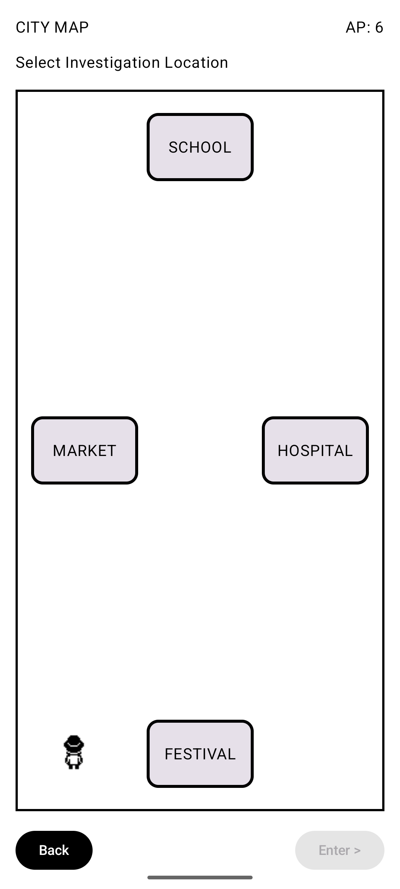

# 🦠 Outbreaker

An Android serious game developed using **Kotlin** and **Jetpack Compose** that introduces players to the fundamentals of outbreak investigation through interactive gameplay.

---

## 📖 Overview

Outbreaker is an educational Android game developed as a university coursework project. Players investigate a disease outbreak by gathering evidence, analysing information, and making decisions to control the spread of infection while learning the basic concepts of public health investigation.

---

## ✨ Features

- Interactive outbreak investigation gameplay
- Multiple investigation locations
- Evidence collection and analysis
- Decision-based gameplay
- Android application built using Jetpack Compose

---

## 🛠 Technologies

- Kotlin
- Jetpack Compose
- Android Studio

---

## 📷 Screenshots

| Main Menu | Dashboard |
|-----------|-----------|
|  |  |

| Map | Investigation |
|-----|---------------|
|  |  |

---

## 📚 Project Status

Completed as a university coursework project with potential for future improvements.
